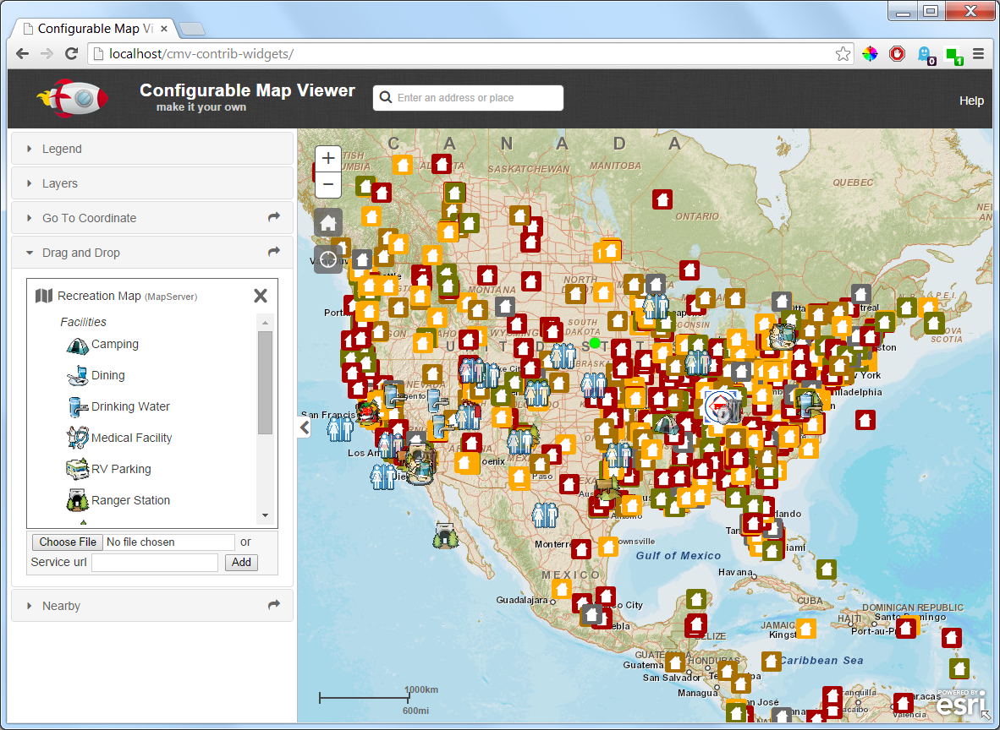

Drag and Drop Widget
=================
Drag-and-Drop widget for the js api. Adapted from [Drag and drop to display data](https://developers.arcgis.com/javascript/jssamples/exp_dragdrop.html) sample.


```javascript
dnd: {
  include: true,
  id: 'dnd',
  type: 'titlePane',
  canFloat: true,
  path: 'gis/dijit/DnD',
  title: 'Drag and Drop',
  options: {
    map: true
  }
}
```
Available drag-and-drop sources:
- CSV
- KML
- Shapefile (see [Best Practices](http://doc.arcgis.com/en/arcgis-online/reference/shapefiles.htm#ESRI_SECTION2_913CE2DFA59845C2926B2842F3AB8D66), adapted from [Add shapefile](https://developers.arcgis.com/javascript/jssamples/portal_addshapefile.html) sample)
- Image
- Text (highlight url and drag-and-drop)
  - MapServer (http://sampleserver6.arcgisonline.com/arcgis/rest/services/Recreation/MapServer)
  - MapServer Layer (http://sampleserver6.arcgisonline.com/arcgis/rest/services/SF311/MapServer/0)
  - FeatureServer Layer (http://sampleserver6.arcgisonline.com/arcgis/rest/services/Military/FeatureServer/2)
  - ImageServer (http://sampleserver6.arcgisonline.com/arcgis/rest/services/Toronto/ImageServer)

Note: doesn't currently support DnD of FeatureServer root directory text (http://sampleserver6.arcgisonline.com/arcgis/rest/services/Military/FeatureServer).


[Click for demo](http://brianbunker.github.com/dojo-esri-dnd-widget)

[Download demo csv, kml, shapefiles, and image](./sampledata)

Screen from Sample page:




TODO
====
- Support for Image urls (problematic because url doesn't necessarily have file extension and need to request image/convert to base64)
- Add multiple files to the map at once
