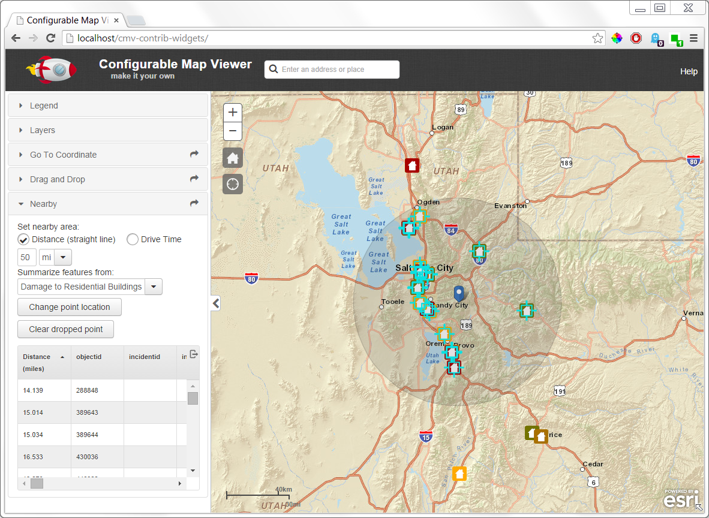

Nearby widget
=================
Nearby widget for the [Configurable Map Viewer (CMV)](https://github.com/cmv/cmv-app) app.

Use by adding the following to viewer.js config file.
```javascript
nearby: {
  include: true,
  id: 'nearby',
  type: 'titlePane',
  canFloat: true,
  path: 'gis/dijit/Nearby',
  title: 'Nearby',
  open: false,
  options: {
    map: true,
    mapClickMode: true
  }
}
```

[Click for demo](http://brianbunker.github.com/dojo-esri-nearby-widget)

Screen from Sample page:


